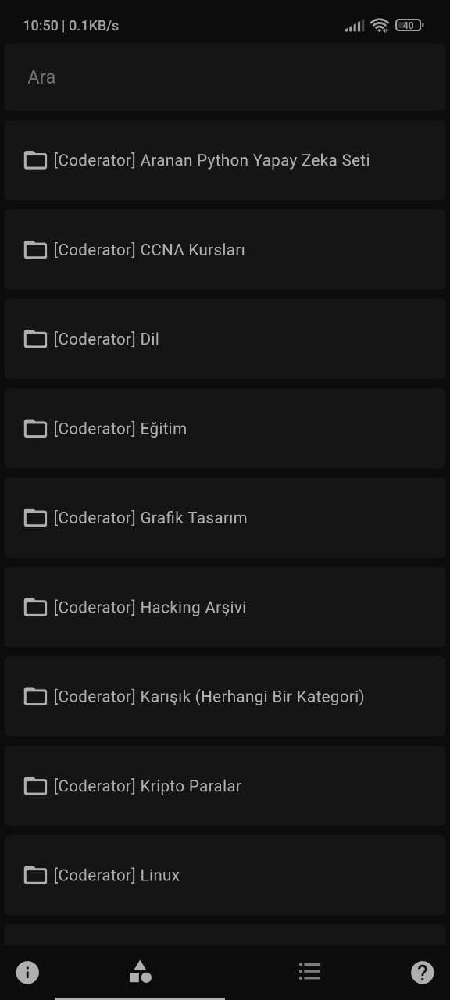
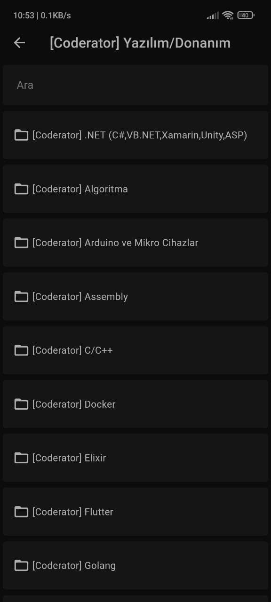
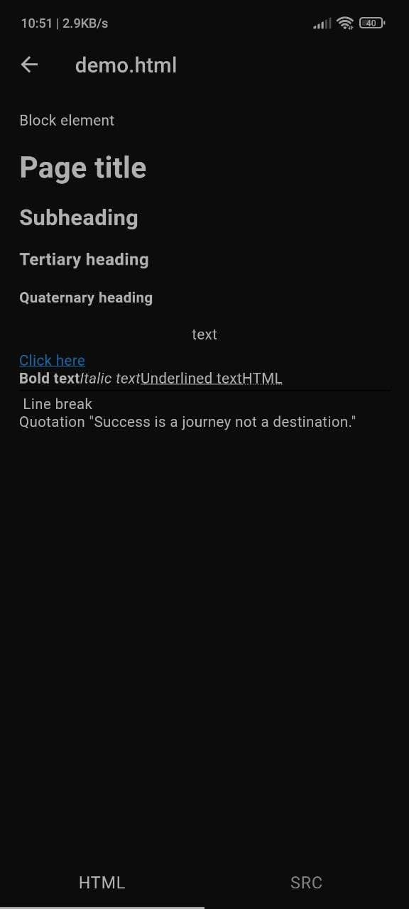
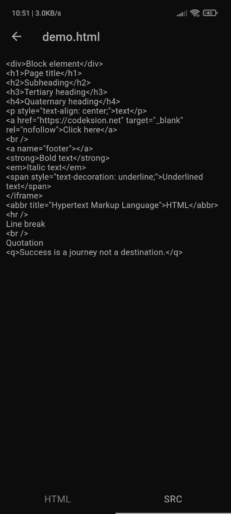
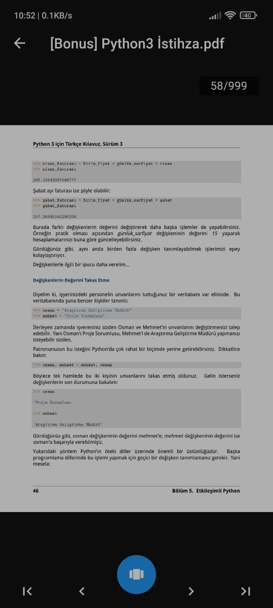

# Coderator Mobil
Coderator Mobil's FOSS repository.
`depo.coderator.net` 's ad-free mobile wrapper.
### Preview (Turkish)


<!--i cant understand. Who and why loves XML-->

### DISCLAIMER
Coderator Mobil and the developer team are not affiliated with the `depo.coderator.net` web address. Coderator Mobil only processes data received from the server. Coderator Mobil, Codeksion and its developer team cannot be held responsible for any legal or illegal content shared on `depo.coderator.net`.

#### Sorumluluk Reddi Beyanı (Turkish)
Coderator Mobil ve geliştirici ekibinin `depo.coderator.net` web adresi ile herhangi bir bağlantısı yoktur. Coderator Mobil sadece sunucudan alınan verileri işler. `depo.coderator.net` adresinde paylaşılan yasal ya da yasadışı içeriklerin herhangi birinden Coderator Mobil, Codeksion ve geliştirici ekibi sorumlu tutulamaz.

### Flutter Build
```
git clone https://github.com/codeksion/CoderatorMobil
cd CoderatorMobil

flutter pub get
flutter build apk --release -v
```

### [# Future Request](https://github.com/codeksion/CoderatorMobil/issues)


